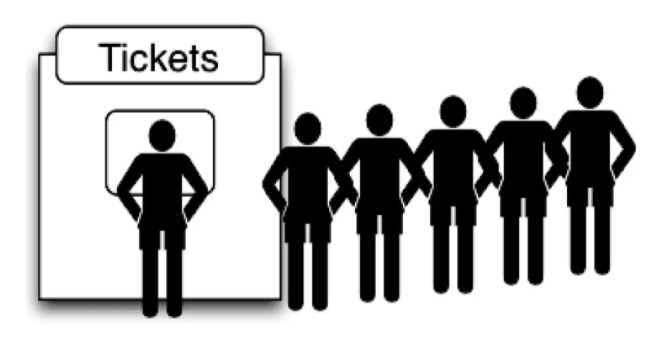
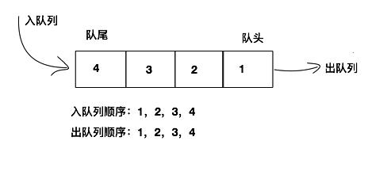

# 一、认识队列

队列（queue），是一种受限的数据结构（<u>**线性结构**</u>），具有 **先进先出**（FIFO，**F**irst **I**n **F**irst **O**ut）的特点。

**受限之处：**

- 只允许在表的前端（front）进行删除操作。
- 只允许在表的后端（rear）进行插入操作。

生活中类似队列结构的场景：

- 排队，比如在电影院，商场，甚至是厕所排队。
- 优先排队的人，优先处理。 (买票、结账、WC)。



**图解队列：**



**队列在程序中的应用：**

- 打印队列：计算机打印多个文件的时候，需要排队打印。
- 线程队列：当开启多线程时，当新开启的线程所需的资源不足时就先放入线程队列，等待 CPU 处理。

# 二、队列的实现

队列的实现和栈一样，有两种方案：

- 基于数组实现。
- 基于链表实现。

```js
// 普通队列
export class Queue {
  constructor() {
    this.items = [];
  }

  // 入队
  enqueue(element) {
    this.items.push(element);
  }

  // 出队
  dequeue() {
    return this.items.shift();
  }

  // 返回队头元素
  front() {
    if (this.isEmpty()) return null;
    return this.items[0];
  }

  // 判断队列是否为空
  isEmpty() {
    return this.items.length === 0;
  }

  // 返回队列的大小
  size() {
    return this.items.length;
  }

  // 清空队列
  clear() {
    this.items = [];
  }
}


// 优先级队列
export class PriorityQueue extends Queue {
  enqueue(element, priority) {
    // 1. 创建QueueElement对象
    const queueElement = { element, priority };
    // 2. 根据优先级插入到合适的位置
    let inserted = false;
    for (let i = 0; i < this.items.length; i++) {
      if (priority < this.items[i].priority) {
        this.items.splice(i, 0, queueElement);
        inserted = true;
        break;
      }
    }
    // 3. 如果优先级最高，则插入到队尾
    if (!inserted) {
      this.items.push(queueElement);
    }
  }
}
```

# 三、队列的应用

## 1. 击鼓传花

使用队列实现小游戏：**击鼓传花**。

分析：传入一组数据集合和设定的数字 number，循环遍历数组内元素，遍历到的元素为指定数字 number 时将该元素删除，直至数组剩下一个元素。

```js
function passGame(nameList, num) {
  // 1. 创建一个对垒
  const queue = new Queue();

  // 2. 将 nameList 里面的每一个元素一次加入到队列中
  for (const name of nameList) {
    queue.enqueue(name);
  }

  // 3. 开始数数：队列中只剩下 1 个元素时就停止数数
  while (queue.size() > 1) {
    // 不是 num 时，重新加入到队列的末尾
    // 是 num 时，将其删除
    for (let i = 0; i < num - 1; i++) {
      queue.enqueue(queue.dequeue());
    }
    // num 对应这个人，直接从队列中删除
    queue.dequeue();
  }

  // 4. 获取剩下的那个人
  return queue.front();
}
```

```js
console.log('击鼓传花：'', passGame(['A', 'B', 'C', 'D', 'E'], 3));
// 击鼓传花： D
```

# 四、优先级队列

##  1. 场景

生活中类似 **优先队列** 的场景：

- 优先排队的人，优先处理。 (买票、结账、WC)。
- 排队中，有紧急情况（特殊情况）的人可优先处理。

## 2. 特点

- 我们知道，普通的队列插入一个元素，数据会被放在后端，并且需要前面所有的元素都处理完成后才会处理前面的数据。
- 但是优先级队列，在插入一个元素的时候会考虑该数据的<u>优先级</u>。
- 和其他数据优先级进行<u>比较</u>，
- 比较完成后，可以得出这个元素在队列中正确的位置。
- 其他处理方式，和基本队列的处理方式一样。

### 3. 代码实现

```js
export class PriorityQueue extends Queue {
  enqueue(element, priority) {
    // 1. 创建QueueElement对象
    const queueElement = { element, priority };
    // 2. 根据优先级插入到合适的位置
    let inserted = false;
    for (let i = 0; i < this.items.length; i++) {
      if (priority < this.items[i].priority) {
        this.items.splice(i, 0, queueElement);
        inserted = true;
        break;
      }
    }
    // 3. 如果优先级最高，则插入到队尾
    if (!inserted) {
      this.items.push(queueElement);
    }
  }
}
```
