# 一、什么是树？

真实的树：


树的特点：

- 树一般都有一个**根**，连接着根的是**树干**；
- 树干会发生分叉，形成许多**树枝**，树枝会继续分叉成更小的**树枝**；
- 树枝的最后是**叶子**;

# 二、模拟树结构

公司组织架构：


现实生活中很多结构都是树的抽象，模拟的树结构相当于旋转 `180°` 的树。

我们将里面的 **数据移除**，仅仅抽象出来 **结构**，那么就是我们要学习的树结构。


# 三、树的优点

我们之前已经学习了多种数据结构来保存数据，为什么要**使用树结构**来保存数据呢?

树结构对比于数组/链表/哈希表有哪些优点呢？

① 数组：

- 优点：通过**下标值访问**，效率高，如果我们希望根据元素来查找对应的位置时，比较好的方式是先对数组进行 **排序**，再进行 **二分查找**。
- 缺点：查找数据时需要先对数据进行**排**序，生成**有序数组**，才能提高查找效率；另外在插入和删除元素时，需要大量的**位移操作**；

② 链表：

- 优点：数据的插入和删除操作效率都很高；
- 缺点：查找效率低，需要从头开始依次查找，直到找到目标数据为止；当需要在链表中间位置插入或删除数据时，插入或删除的效率都不高。

③ 哈希表：

- 优点：哈希表的插入/查询/删除效率都非常高；
- 缺点：
  - **空间利用率不高**，底层使用的是数组，并且某些单元是没有被利用的；
  - 哈希表中的元素是**无序**的，不能按照固定的顺序来遍历哈希表中的元素；
  - 不能快速找出哈希表中**最大值或最小值**这些特殊值。

④ 树结构：

- 我们不能说树结构比其他结构都要好，因为 **每种数据结构都有自己特定的应用场景**。
- 但是树确实也综合了上面的数据结构的优点（当然优点不足于盖过其他数据结构，比如效率一般情况下没有哈希表高）
- 并且也弥补了上面数据结构的缺点。
- 为了模拟某些场景，我们使用树结构会更加方便：因为树结构是非线性的，可以表示一对多的关系，比如文件的目录结构

总的来说：**每种数据结构都有自己特定的应用场景。**

# 四、树的术语

树结构：

- 树（Tree）：$n(n >= 0)$ 个节点构成的**有限集合**。

   当 $n = 0$ 时，称为 **空树**

- 对于任何一颗非空树 ($n > 0$)，它具备以下性质：

  - 树中有一个称为 **根（Root）** 的特殊节点，用 `R` 表示；
  - 其余节点可分为 $m(m > 0)$ 个互不相交的有限集 $T1, T2... Tm$ ，其中每个集合本身又是一棵树，称为原来树的 **子树（SubTree）**

常用术语：



- 节点的度（Degree）：节点的**子树个数**（即子节点的个数），比如节点 B 的度为 2；
- 树的度：树的所有节点中**最大的度数**，如上图树（二叉树）的度为 2；
- 叶节点（Leaf）：**度为 0 的节点**（也称为叶子节点），如上图的 H，I 等；
- 父节点（Parent）：度不为 0 的节点称为父节点，如上图节点 B 是节点 D 和 E 的父节点；
- 子节点（Child）：若 B 是 D 的父节点，那么 D 就是 B 的子节点；
- 兄弟节点（Sibling）：具有同一父节点的各节点彼此是兄弟节点，比如上图的 B 和 C，D 和 E 互为兄弟节点；
- 路径和路径长度：路径指的是一个节点到另一节点的通道，路径所包含边（节点和节点之间的连线）的个数称为路径长度，比如 A→H 的路径长度为 3；
- 节点的层次（Level）：规定**根节点在 1 层**，其他任一节点的层数是其父节点的层数加 1。如 B 和 C 节点的层次为 2；
- 树的深度（Depth）：树种所有节点中的**最大层次**是这棵树的深度，如上图树的深度为 4；

# 五、树结构的表示方式

**① 最普通的表示方式**


如图，树结构的组成方式类似于链表，都是由一个个节点连接构成。不过，根据每个父节点子节点数量的不同，每一个父节点需要的引用数量也不同。比如节点 A 需要 3 个引用，分别指向子节点 B，C，D；B 节点需要 2 个引用，分别指向子节点 E 和 F；K 节点由于没有子节点，所以不需要引用。

这种方法缺点在于我们无法确定某一结点的引用数。

**② 儿子 - 兄弟表示法**


这种表示方法可以完整地记录每个节点的数据，比如：

```js
// 节点A
Node {
  
  this.data = data; // 存储数据
  this.leftChild = B; // 统一只记录左边的子节点
  this.rightSibling = null; // 统一只记录右边的第一个兄弟节点
}

// 节点B
Node{
  this.data = data;
  this.leftChild = E;
  this.rightSibling = C;
}

// 节点F
Node{
  this.data = data;
  this.leftChild = null;
  this.rightSibling = null;
}
```

这种表示法的优点在于每一个节点中引用的数量都是确定的。

**③ 儿子-兄弟表示法旋转**

将儿子-兄弟表示法组成的树结构顺时针旋转 45° 之后：


这样就成为了一棵**二叉树**，由此我们可以得出结论：**任何树都可以通过二叉树进行模拟**。但是这样父节点不是变了吗？其实，父节点的设置只是为了方便指向子节点，在代码实现中谁是父节点并没有关系，只要能正确找到对应节点即可。

