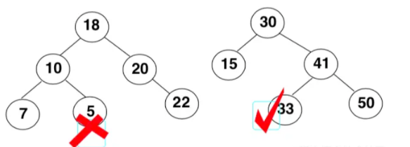

# 一、概念

二叉搜索树（BST，**B**inary **S**earch **T**ree），也称为 **二叉排序树** 和 **二叉查找树**。

二叉搜索树是一颗二叉树，可以为空；如果不为空，满足以下性质：

- 非空 **左子树** 的所有 **键值小于其根节点** 的键值；
- 非空 **右子树** 的所有 **键值大于其根节点** 的键值；
- **左、右子树本身也都是二叉搜索树；**

比如下面两棵树，左边的树，因为5小于10，应该在10的左子树上，因此不是二叉查找树，右边的树则符合二叉查找树的条件。



> 最大元素一定是在树的最右分枝的端结点上
> 最小元素一定是在树的最左分枝的端结点上

# 二、封装

- `insert(key)`：向树中插入一个新的键。

- `search(key)`：在树中查找一个键,如果节点存在,则返回true ;如果不存在,则返回false。

- `inOrderTraverse`：通过中序遍历方式遍历所有节点。

- `preOrderTraverse`：通过先序遍历方式遍历所有节点。

- `postOrderTraverse`：通过后序遍历方式遍历所有节点。

- `min`：返回树中最小的值/键。

- `max`：返回树中最大的值/键。

- `remove(key)`：从树中移除某 个键。

准备工作：

```js
// 节点对象类
class BinarySearchTreeNode {
  constructor(key) {
    this.key = key;    // 存储的数据
    this.left = null;  // 左子节点
    this.right = null; // 右子节点
  }
}

// 二叉搜索树类
export class BinarySearchTree {
  constructor() {
    this.root = null;
  }
}
```

## 1. 插入

```js
_insertNode(node, newNode) {
  if (newNode.key < node.key) {
    // 向左查找
    if (node.left === null) {
      node.left = newNode;
    } else {
      this._insertNode(node.left, newNode);
    }
  } else {
    // 向右查找
    if (node.right === null) {
      node.right = newNode;
    } else {
      this._insertNode(node.right, newNode);
    }
  }
}
// 插入：对外暴露的方法
insert(key) {
  // 1. 根据key创建对应的节点
  const newNode = new BinarySearchTreeNode(key);
  // 2. 判断根节点是否有值
  if (this.root) {
    this._insertNode(this.root, newNode);
  } else {
    this.root = newNode;
  }
}
```


