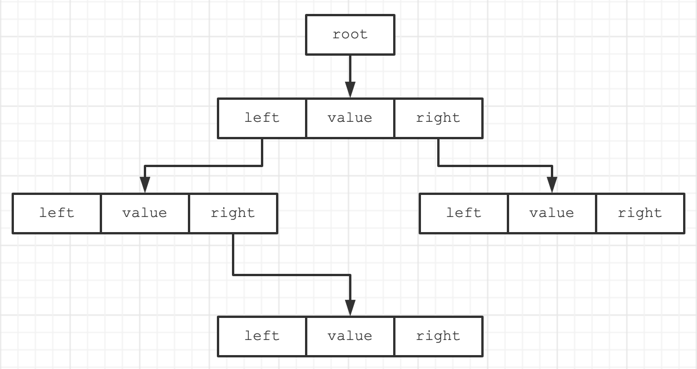
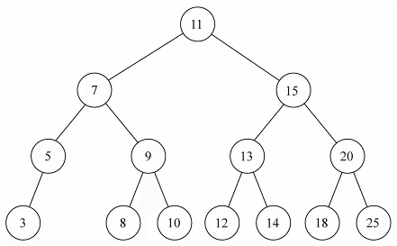
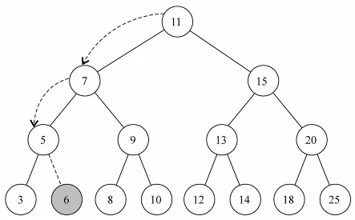
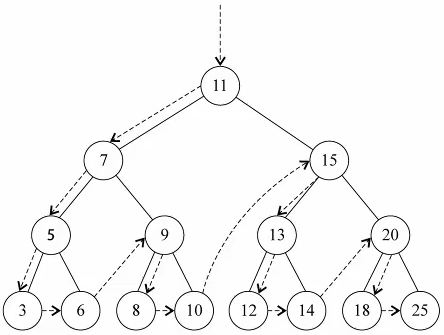
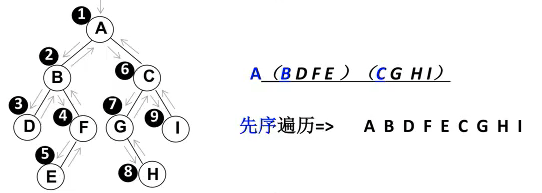
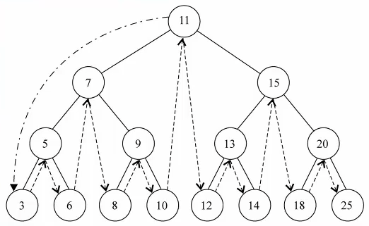
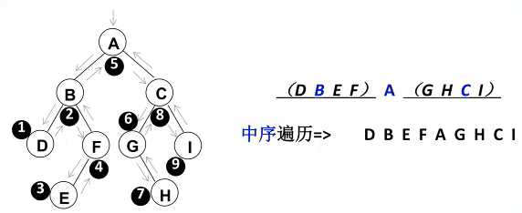
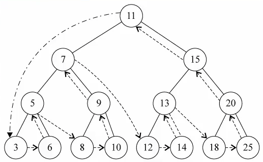
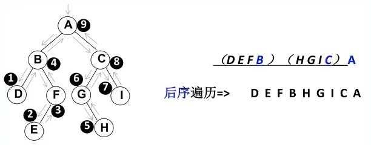
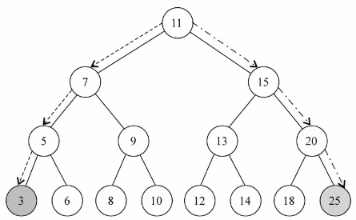

# 一、概念

二叉搜索树（BST，**B**inary **S**earch **T**ree），也称为 **二叉排序树** 和 **二叉查找树**。

二叉搜索树是一颗二叉树，可以为空；如果不为空，满足以下性质：

- 非空 **左子树** 的所有 **键值小于其根节点** 的键值；
- 非空 **右子树** 的所有 **键值大于其根节点** 的键值；
- **左、右子树本身也都是二叉搜索树；**

比如下面两棵树，左边的树，因为5小于10，应该在10的左子树上，因此不是二叉查找树，右边的树则符合二叉查找树的条件。


二叉搜索树的 **特点** 是相对**较小的值**总是保存在**左节点**上，相对**较大的值**总是保存在**右节点上**。

二叉搜索树的这个特点使得其查找效率非常高。

# 二、封装

二叉搜索树常见操作：

- `insert(value)`：插入节点到二叉搜索树中。
- `search(value)`：在二叉搜索树中查找指定值的节点。
- `remove(value)`：从二叉搜索树中删除指定值的节点。
- `inorderTraverse`：通过中序遍历方式遍历所有节点。
- `preOrderTraverse`：通过先序遍历方式遍历所有节点（升序）。
- `postOrderTraverse`：通过后序遍历方式遍历所有节点。
- `min`：返回树中最小的值/键。
- `max`：返回树中最大的值/键。

准备工作：

```js
// 二叉搜索树节点类
class BinarySearchTreeNode {
  constructor(value) {
    this.value = value; // 节点对应的值
    this.left = null;   // 左子节点
    this.right = null;  // 右子节点
  }
}

// 二叉搜索树类
export class BinarySearchTree {
  constructor() {
    // 对于BinarySearchTree来说，只需要保存根节点即可，因为其他节点都可以通过根节点找到
    this.root = null;
  }
}
```

结构图如下：



## 1. 插入数据

```js
/**
 * 插入节点到二叉搜索树中
 * @param {number} value - 要插入的节点值
 */
insert(value) {
  // 1. 根据value创建对应的节点
  const newNode = new BinarySearchTreeNode(value);
  // 2. 如果根节点为空，则新节点为根节点
  if (this.root) {
    this.insertNode(this.root, newNode);
  } else {
    this.root = newNode;
  }
}
/**
 * 递归地插入节点到二叉搜索树中的合适位置
 * @param {Node} node - 当前节点
 * @param {Node} newNode - 要插入的新节点
 */
insertNode(node, newNode) {
  if (newNode.value < node.value) {
    // 向左查找：如果新节点的值小于当前节点的值，则将新节点插入当前节点的左子树
    if (node.left === null) {
      node.left = newNode;
    } else {
      this.insertNode(node.left, newNode);
    }
  } else {
    // 向右查找：如果新节点的值大于等于当前节点的值，则将新节点插入当前节点的右子树
    if (node.right === null) {
      node.right = newNode;
    } else {
      this.insertNode(node.right, newNode);
    }
  }
}
```

代码测试：

```js
const bst = new BinarySearchTree();
bst.insert(11);
bst.insert(7);
bst.insert(15);
bst.insert(5);
bst.insert(3);
bst.insert(9);
bst.insert(8);
bst.insert(10);
bst.insert(13);
bst.insert(12);
bst.insert(14);
bst.insert(20);
bst.insert(18);
bst.insert(25);
```

二叉树示例：



接下来，我们再插入一个 6，观察位置：



## 2. 遍历二叉搜索树

前面，我们向树中插入了很多的数据，为了能看到测试结果，我们先来学习一下**树的遍历** 

- 注意: 这里我们学习的树的遍历,针对所有的二叉树都是适用的,不仅仅是二叉搜索树


树的遍历：

- 遍历一棵树是指**访问树的每个节点**（也可以对每个节点进行某些操作，我们这里就是简单的打印） 

- 但是树和线性结构不太一样，线性结构我们通常按照从前到后的顺序遍历，但是树呢？

- 应该从树的顶端还是底端开始呢？从左开始还是从右开始呢？

叉树的遍历常见的有**三种方式**：

- 先序遍历
- 中序遍历
- 后序遍历
- *还有层序遍历，使用较少，可以使用队列来完成，此处不再给出实现*

### 2.1. 先序遍历

遍历过程为：

1. 访问根节点
2. 先序遍历其左子树
3. 先序遍历其右子树





代码示例：

```js
/**
 * 先序遍历
 * @returns {number[]} - 有序的节点值数组
 */
preOrderTraverse() {
  const result = [];
  this.preOrderTraverseNode(this.root, result);
  return result;
}
/**
 * 递归地先序遍历二叉搜索树
 * @param {Node} node - 当前节点
 * @param {number[]} result - 保存遍历结果的数组
 */
preOrderTraverseNode(node, result) {
  if (node) {
    // 1. 处理经过的节点
    result.push(node.value);
    // 2. 处理经过节点的左子节点
    this.preOrderTraverseNode(node.left, result);
    // 3. 处理经过节点的右子节点
    this.preOrderTraverseNode(node.right, result);
  }
}
```

### 2.2. 中序遍历

遍历过程为：

1. 中序遍历其左子树
2. 访问根节点
3. 中序遍历其右子树





代码示例：

```js
/**
 * 中序遍历二叉搜索树（升序输出）
 * @returns {number[]} - 有序的节点值数组
 */
inorderTraverse() {
  const result = [];
  this.inorderTraverseNode(this.root, result);
  return result;
}
/**
 * 递归地中序遍历二叉搜索树
 * @param {Node} node - 当前节点
 * @param {number[]} result - 保存遍历结果的数组
 */
inorderTraverseNode(node, result) {
  if (node) {
    // 1. 处理左子树中的节点
    this.inorderTraverseNode(node.left, result);

    // 2. 处理节点
    result.push(node.value);

    // 3. 处理右子树种的节点
    this.inorderTraverseNode(node.right, result);
  }
}
```

### 2.3. 后续遍历

遍历过程为：

1. 后序遍历其左子树
2. 后序遍历其右子树
3. 访问根节点





代码示例：

```js
/**
 * 后续遍历二叉搜索树（升序输出）
 * @returns {number[]} - 有序的节点值数组
 */
postOrderTraverse() {
  const result = [];
  this.postOrderTraverseNode(this.root, result);
  return result;
}
/**
 * 递归地后序遍历二叉搜索树
 * @param {Node} node - 当前节点
 * @param {number[]} result - 保存遍历结果的数组
 */
postOrderTraverseNode(node, result) {
  if (node) {
    // 1. 处理左子树中的节点
    this.inorderTraverseNode(node.left, result);
    // 2. 处理右子树种的节点
    this.inorderTraverseNode(node.right, result);
    // 3. 处理节点
    result.push(node.value);
  }
}
```

## 3. 最大值 & 最小值

在二叉搜索树中搜索最值是一件非常简单的事情，其实用眼睛看就可以看出来了。



从上图看一看书，树的最左侧为最小值，最右侧为最大值。

代码示例：

```js
/**
 * 找到二叉搜索树中最小的节点值
 * @returns 最小节点的值
 */
min() {
  // 1. 判断根节点是否存在
  if (!this.root) {
    return null;
  }
  // 2. 存在，则查找最小节点
  const minNode = this.findMinNode(this.root);
  // 3. 返回最小节点的值
  return minNode.value;
}
/**
 * 找到二叉搜索树中最小的节点
 * @param {Node} node - 当前节点
 * @returns {Node} - 最小节点
 */
findMinNode(node) {
  if (!node.left) {
    return node;
  } else {
    return this.findMinNode(node.left);
  }
}

/**
 * 最大值
 * @returns
 */
max() {
  // 1. 判断根节点是否存在
  if (!this.root) {
    return null;
  }
  // 2. 存在，则查找最大节点
  const maxNode = this.findMaxNode(this.root);
  // 3. 返回最大节点的值
  return maxNode.value;
}
/**
 * 找到二叉搜索树中最大的节点
 * @param {Node} node - 当前节点
 * @returns {Node} - 最大节点
 */
findMaxNode(node) {
  if (node.right === null) {
    return node;
  } else {
    return this.findMaxNode(node.right);
  }
}
```

## 4. 搜索特定的值

二叉树不仅仅在获取最值效率非常高，搜索特定值的效率也非常高。

代码示例：

```js
/**
 * 在二叉搜索树中查找指定值的节点
 * @param {number} value - 要查找的值
 * @returns {Node|null} - 找到的节点，若未找到则返回null
 */
search(value) {
  return this.searchNode(this.root, value);
}

/**
 * 递归地在二叉搜索树中查找指定值的节点
 * @param {Node} node - 当前节点
 * @param {number} value - 要查找的值
 * @returns {Node|null} - 找到的节点，若未找到则返回null
 */
searchNode(node, value) {
  // 若节点为空或节点的值等于要查找的值，则返回节点
  if (node === null || node.value === value) {
    return node;
  }
  // 如果要查找的值小于当前节点的值，则在左子树中递归查找
  else if (value < node.value) {
    return this.searchNode(node.left, value);
  }
  // 如果要查找的值大于当前节点的值，则在右子树中递归查找
  else {
    return this.searchNode(node.right, value);
  }
}
```

## 5. 删除 *

二叉搜索树的删除有些复杂，删除节点首先要做的事情是找到该节点，找到节点后，需要考虑三种情况：

1. 该节点是叶节点（没有子节点，比较简单）
2. 该节点只有一个子节点（也相对简单）
3. 该节点有两个子节点（情况比较复杂，我们后面慢慢道来）

所以删除节点的大致思路是：

1. 找到要删除的节点，如果没有找到，不需要删除
2. 找到了
   - 删除叶子节点
   - 删除只有一个子节点的节点
   - 删除有两个子节点的节点

代码示例：

```js
/**
 * 从二叉搜索树中删除指定值的节点
 * @param {number} value - 要删除的节点值
 */
remove(value) {
  this.root = this.removeNode(this.root, value);
}

/**
 * 递归地从二叉搜索树中删除指定值的节点
 * @param {Node} node - 当前节点
 * @param {number} value - 要删除的节点值
 * @returns {Node|null} - 删除节点后的新子树根节点
 */
removeNode(node, value) {
  if (node === null) {
    return null;
  }

  if (value < node.value) {
    node.left = this.removeNode(node.left, value);
    return node;
  } else if (value > node.value) {
    node.right = this.removeNode(node.right, value);
    return node;
  } else {
    // 当前节点为要删除的节点
    // 情况1: 要删除的节点为叶子节点
    if (node.left === null && node.right === null) {
      node = null;
      return node;
    }

    // 情况2: 要删除的节点只有一个子节点
    if (node.left === null) {
      node = node.right;
      return node;
    } else if (node.right === null) {
      node = node.left;
      return node;
    }

    // 情况3: 要删除的节点有两个子节点
    const minNode = this.findMinNode(node.right);
    node.value = minNode.value;
    node.right = this.removeNode(node.right, minNode.value);
    return node;
  }
}
```


# 三、平衡树（二叉搜索树缺陷）

二叉搜索树可以 **快速地** 找到给定关键数字的数据项，并且可以快速地 **删除和插入数据项**。

但是，二叉搜索树有一个很麻烦的问题：如果插入的数据是 **有序的数据**，比如下面的情况。

在线演示：[点击前往 >>](https://www.cs.usfca.edu/~galles/visualization/BST.html)

1）有一棵初始化为 9 8 12 的二叉树，如下图所示：


2）插入下面的数据：7 6 5 4 3，如下图所示：


我们知道，在二叉搜索树中，效率和深度有关，上面的示例是一棵 **非平衡树**。

比较好的二又搜索树数据应该是**左右分布均匀**的，但是插入连续数据后，分布的不均匀，我们称这种树为**非平衡树**，对于一棵平衡二叉树来说，插入/查找等操作的效率是 $O(logN)$ ，对于一棵非平衡二叉树，相当于编写了一个链表，查找效率变成了 $O(N)$ 。

为了能以 **较快的时间 $O(logN)$** 来操作一棵树，我们需要**保证树总是平衡的**：

- 至少大部分是平衡的，那么时间复杂度也是接近 $O(logN)$ 的
- 也就是说树中每个节点 **左边的子孙节点的个数**，应该尽可能的等于**右边的子孙节点的个数**
- 常见的平衡树有哪些呢?
  - AVL树：
    - AVL树是最早的一种平衡树，它有些办法**保持树的平衡**（每个节点多存储了一个额外的数据）
    - 因为AVL树是平衡的，所以时间复杂度也是 $O(logN)$
    - 但是，每次插入/删除操作相对于红黑树效率都不高，所以**整体效率不如红黑树**
  - 红黑树：
    - 红黑树也通过**一些特性**来保持树的平衡
    - 因为是平衡树，所以时间复杂度也是在 $O(logN)$
    - 另外插入/删除等操作，红黑树的性能要优于AVL树，所以现在平衡树的应用基本都是红黑树


