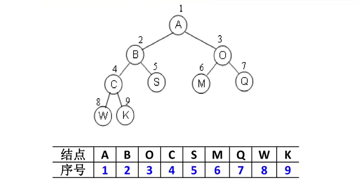
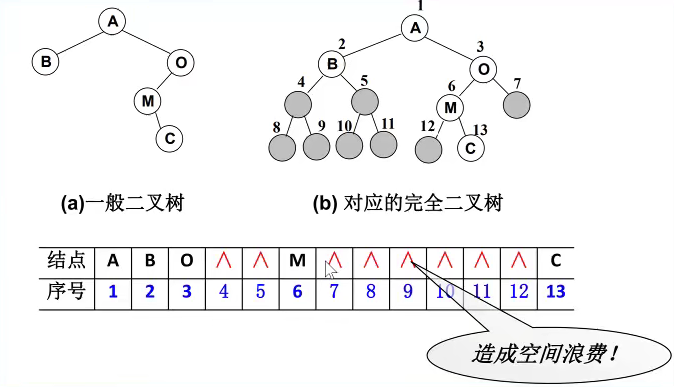
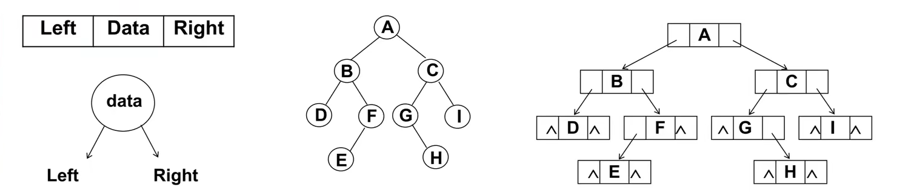

# 一、概念

如果树中最多只能有两个子节点，这样的树就被称为 **<u>二叉树</u>**。几乎所有的树都可以表示成二叉树的形式。

- 二叉树可以为空，也就是没有子节点。
- 若不为空，则它是由根节点和称为其左子树（`TL`）和右子树（`TR`）的两个不相交的二叉树组成。

二叉树的5种基本形态：

# 二、特性

二叉树有几个比较重要的特性，在笔试题中比较常见：

- 一个二叉树第 `i` 层的最大节点数为：$2^{(i - 1)}, i >= 1$；
- 深度为 `K` 的二叉树的最大节点总数为：$2^k - 1, k >= 1$；
- 对任何非空二叉树 `T`，若 `n0` 表示叶节点的个数， `n2` 是度为2的非叶节点个数，那么两者满足关系 `n0 = n2 + 2`;

# 三、二叉树类型

**① <u>完美二叉树</u>**

完美二叉树（Perfect Binary Tree），也称为满二叉树（Full Binary Tree），在二叉树中，<u>除了最下一层的节点外，每层节点都有**2**个子节点</u>，就构成了满二叉树。

**② <u>完全二叉树</u>**

完全二叉树（Complete Binary Tree）

- 除二叉树最后一层外，其他各层的节点数都达到最大个数。
- 且最后一层从左向右的节点连续存在，只缺右侧若干节点。
- 完美二叉树是特殊的完全二叉树。

# 四、二叉树的存储

二叉树的存储常见的方式是 <u>数组</u> 和 **<u>链表</u>**。

## 1. 使用数组

**① 完全二叉树**

按从上至下，从左到右顺序存储

**② 非完全二叉树**

非完全二叉树要转成完全二叉树才可以按照上面的方案存储，但是会造成很大的空间浪费。

## 2. 使用链表

二叉树最常见的方式还是使用链表存储。

每个节点封装成一个 Node，Node中包含：*存储的数据*、*左节点的引用*、*右节点的引用*

