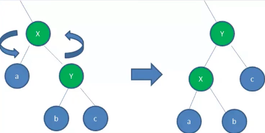

# 一、邂逅红黑树

首先，红黑树很难，难到什么程度呢？

基本你跟别人聊数据结构的时候，他不会和你聊红黑树，因为它是数据结构中一个**难点中的难点**

数据结构的学习本来就比较难了，红黑树是又将难度**上升一个档次**的知识点

面试的时候经常出现这个场景：

- 面试官: 你知道红黑树吗？
- 面试者: 知道啊
- 面试官: 知道原理吗?
- 面试者: 不知道啊
- 面试官: 那你让“不’过来面试我们公司吧，你先回去等通知吧

哪些面试会出现红黑树呢？

- 通常在比较知名的互联网公司面试时会出现红黑树的题目

- 因为它可以作为你对数据结构掌握深度的很好考察点

- 但是在除去大型互联网公司之外，几乎不会考察到红黑树

- 因为面试官很有可能自己都不懂

OK，在这里，我们就一起来踏入数据结构 **红黑树这块禁区**

# 二、红黑树的规则


红黑树，除了符合二又搜索树的基本规则外，还添加了一些特性：

1. 节点只能是红色或黑色。
2. 根节点是黑色。
3. 每个叶子节点都是黑色的空节点（NIL节点）。
4. 每个红色节点的两个子节点都是黑色的。（*从每个叶子到根的所有路径上不能有两个连续的红色节点*）
5. 从任一节点到其每个叶子节点的所有路径都包含相同数目的黑色节点，也称为"黑色高度相同"。

这些规则确保了红黑树的平衡和性能。通过这些规则，红黑树保持了相对平衡的状态，避免了出现过于倾斜的情况，从而保证了搜索、插入和删除等操作的时间复杂度都是 $O(logN)$。

# 三、红黑树的相对平衡

前面的约束，确保了红黑树的关键特性：

- 从**根到叶子**的**最长可能路径**，不会超过**最短可能路径**的**两倍长**。
- 结果就是这个树**基本**是平衡的
- 虽然没有做到绝对的平衡，但是可以保证在最坏的情况下，依然是高效的

为什么可以做到 **最长路径不超过最短路径的两倍** 呢？

- **性质4** 决定了路径不可能有两个相连的红色节点，因此：
  - 最短的路径可能都是黑色节点
  - 最长的路径只可能是红色和黑色交替的节点
- **性质5** 决定了所有路径都有相同数目的黑色节点
- 这就表明了没有路径能多余任何其他路径的两倍长

# 四、变换

插入一个新节点时，有可能树不再平衡，可以通过三种方式的变换，让树保持平衡：变色/左旋转/右旋转

> **变色**

为了重新符合红黑树的规则，尝试把**红色节点**变为**黑色**，或者把**黑色节点**变为**红色**。

首先，需要知道，插入的**新节点**通常都是**红色节点**：

- 因为在**插入节点为红色**的时候，有可能插入一次是**不违反红黑树任何规则**的
- 而**插入黑色节点**，必然会导致有一条路径上**多了黑色节点**，这是很难调整的
- 红色节点**可能导致出现红红相连**的情况，但是这种情况可以通过**颜色调换和旋转**来调整

> **左旋转**

```ini
       A                       B
      / \                     / \
     a   B      →            A   c
        / \                 / \
       b   c               a   b

```


**逆时针** 旋转红黑树的两个节点，使得父节点被自己的右孩子取代，而自己成为自己的左孩子。



图中，身为右孩子的Y取代了X的位置，而X变成了Y的左孩子。此为左旋转。

> **右旋转**

**顺时针** 旋转红黑树的两个节点，使得父节点被自己的左孩子取代，而自己成为自己的右孩子。


图中，身为左孩子的Y取代了X的位置，而X变成了Y的右孩子。

