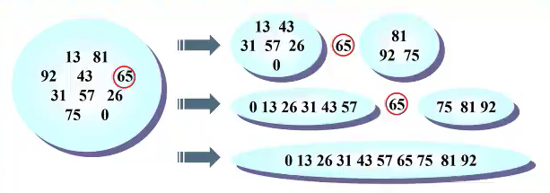

# 一、概述

**快速排序：一种高效的排序算法**

**快速排序**几乎可以说是目前**所有排序算法中最快**的一种。当然，并不存在一种算法在任意情况下都是最优的。例如，希尔排序在某些情况下可能优于快速排序。然而，在大多数情况下，快速排序仍然是一个较好的选择。

快速排序的**重要性**不可忽视。如果有一天你面试时被要求写一个排序算法，你可能会写出多个排序算法的实现，但如果其中没有包括快速排序，那就意味着你对排序算法只是了解皮毛，并没有深入研究过。因为快速排序几乎是排序算法中最常见的一种，无论是在C++的STL中还是Java的SDK中，你都能找到它的影子。

事实上，快速排序被列为20世纪十大算法之一，这凸显了它在计算机科学和软件开发领域中的重要性。

# 二、思想

## 1. 认识快速排序

**希尔排序**是**插入排序**的改进版，而**快速排序**则可以看作是**冒泡排序**的改进版。

冒泡排序需要多次交换才能将最大值移动到正确的位置，而快速排序可以在一次递归调用中找到某个元素的正确位置，并且该元素之后的元素无需移动。快速排序的核心思想是**分而治之**。



举个例子来说明快速排序的过程：假设我们有一组需要排序的数字：

1. 首先，我们选择其中的一个元素，比如选择数字65作为例子。
2. 然后，通过特定的算法，将所有小于65的数字放在65的左边，将所有大于65的数字放在65的右边。
3. 接下来，我们对左边的数据进行递归处理（以31作为例子），同时对右边的数据进行递归处理（以75或81作为例子）。
4. 不断递归处理，直到排序完成。

快速排序的特点是能够快速地定位元素的正确位置，避免了多次交换的开销，因此它的性能相对较好。通过分而治之的策略，快速排序能够高效地对大规模数据进行排序。这使得快速排序成为学习和应用的重要算法之一。

## 2. 和冒泡排序有何区别？

快速排序与冒泡排序不同之处在于**元素定位的方式**。

在快速排序中，我们选择一个元素（如65）并将其直接放置在正确的位置上，无需进行任何移动操作。相反，冒泡排序需要通过两两比较来找到最大值，并不断将最大值向后移动，直到它到达最后的位置。

换句话说，即使冒泡排序找到了最大值，它仍然需要继续移动该最大值。而插入排序在一次循环中就能够确定每个元素的正确位置，避免了多余的移动操作。

这种区别导致快速排序的效率相对较高。通过一次递归调用就可以快速定位元素的正确位置，而不需要像冒泡排序那样进行多次的交换操作。因此，快速排序是一种高效的排序算法。

# 三、思路

快速排序利用了**分而治之**的策略，通过将数组分成较小的子数组并对它们进行递归排序，最终将它们合并为一个有序数组。它的核心思想是选择一个基准元素（枢纽），并通过分区操作将数组中的元素分为小于基准元素和大于基准元素的两部分。然后，对这两部分分别进行递归排序，直到排序完成。


快速排序具有良好的平均时间复杂度，为$O(N log N)$，其中N是待排序数组的大小。然而，在最坏情况下，快速排序的时间复杂度为$O(N^2)$，但这种情况相对较少出现。

快速排序是一种原地排序算法，不需要额外的辅助空间，因此在空间复杂度上具有优势。它的高效性和广泛应用使得掌握快速排序成为计算机科学和算法领域的基本知识之一。无论是在面试中还是实际的软件开发中，了解和熟练运用快速排序都是至关重要的。

# 四、枢纽选择

在快速排序中，选择一个合适的枢纽（也称为主元）是非常重要的步骤。

常见的方案有以下几种：

1. 选择第一个元素作为枢纽。
2. 使用随机数来选择枢纽。
3. **选择头、中间和尾部元素的中位数作为枢纽**。

直接选择第一个元素作为枢纽（方案1）在某些情况下的效率可能不高。使用随机数选择枢纽（方案2）会引入随机性，但生成随机数本身会带来性能开销。

相比之下，选择头、中间和尾部元素的中位数作为枢纽（方案3）在大多数情况下更为优秀。以数字1、2、3为例，中位数是2。这种方法能够更好地均衡枢纽的选择，提高快速排序的性能和效率。

通过选择合适的枢纽，可以有效地减少排序过程中的比较和交换次数，从而提高快速排序的性能和排序结果的质量。

# 五、代码实现

https://www.bilibili.com/video/BV1JM4y1h7ay/?spm_id_from=333.337.search-card.all.click&vd_source=b539518f043998f08c722489225f1c3c

```js
/**
 * 快速排序
 * @param {*} arr
 * @param {*} left
 * @param {*} right
 * @returns
 */
function quickSort(arr, left = 0, right = arr.length - 1) {
  // 当左指针大于等于右指针时，数组已经有序，无需继续排序
  if (left >= right) {
    return;
  }

  // 选择枢纽元素
  const pivotIndex = Math.floor((left + right) / 2);
  const pivot = arr[pivotIndex];

  // 将枢纽元素放到数组的最右边
  [arr[pivotIndex], arr[right]] = [arr[right], arr[pivotIndex]];

  // 使用双指针进行分区操作
  let i = left; // 左指针
  let j = right - 1; // 右指针

  while (i <= j) {
    // 左指针找到大于枢纽的元素
    while (i <= j && arr[i] <= pivot) {
      i++;
    }

    // 右指针找到小于枢纽的元素
    while (i <= j && arr[j] >= pivot) {
      j--;
    }

    // 交换左右指针找到的元素
    if (i < j) {
      [arr[i], arr[j]] = [arr[j], arr[i]];
    }
  }

  // 将枢纽元素放回正确的位置
  [arr[i], arr[right]] = [arr[right], arr[i]];

  // 对枢纽左边的子数组进行递归排序
  quickSort(arr, left, i - 1);

  // 对枢纽右边的子数组进行递归排序
  quickSort(arr, i + 1, right);
}
```

# 六、效率

快速排序的最坏情况效率是当每次选择的枢纽都是最左边或最右边的元素时。在这种情况下，快速排序的效率等同于冒泡排序，即$O(N^2)$。然而，在我们的实现中，我们选择了三个元素的中位数作为枢纽，所以不会出现最坏情况。因此，我们的快速排序在任何情况下都不会达到最坏情况。

快速排序的平均效率是$O(N * logN)$。尽管其他某些算法的效率也可以达到$O(N * logN)$，但是快速排序是最好的选择。