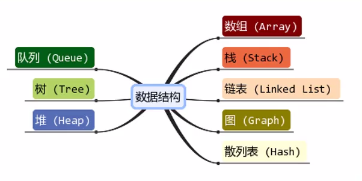

# # 前言

本仓库内容根据哔哩哔哩 [《JavaScript 数据结构与算法》](https://www.bilibili.com/video/BV1x7411L7Q7?p=1) 视频整理的学习笔记，视频教程讲的特别好，配合本仓库的代码测试环境来练习，学习效果更佳，欢迎同学们 Star 和 Fork。

推荐大家按照目录顺序来学习，由浅入深，循序渐进，轻松搞定数据结构和算法。

> 重点要掌握数据结构与算法的思想和原理，使用哪种编程语言区别不大。

# 一、什么是数据结构？

## 1. 数据结构的定义

民间定义

- 数据结构是数据对象，以及存在于该对象的实例和组成实例的数据元素之间的各种关系。这些联系可以通过定义相关的函数来给出。 --《数据结构、算法与应用》
- 数据结构是 ADT（抽象数据类型 Abstract Data Type）的物理实现。 --《数据结构与算法分析》
- 数据结构（data structure）是计算机中存储、组织数据的方式。通常情况下，精心选择的数据结构可以带来最优效率的算法。 --中文维基百科（*）

自己的角度来理解：

- 数据结构就是在计算机中，存储和组织数据的方式。
- 我们知道，计算机中数据量非常庞大，如何以高效的方式组织和存储数据呢？
- 这就好比一个庞大的图书馆中存放了大量的数据，我们不仅仅把书放进去，还应在合适的位置找出来。

## 2. 数据结构在生活中应用

我们知道，计算机中数据量非常庞大，如何以高效的方式组织和存储呢?

例如：一个庞大的图书馆中存放了大量的书籍，我们不仅仅要把书放进入，还应该在合适的时候能够取出来。

图书摆放要使得两个相关操作方便实现：

- 操作 1：新书怎么插入？
- 操作 2：怎么找到某本指定的书？

图书各种摆放方式：

- 方法 1：随便放
  - 操作 1：哪里有空位放哪里。
  - 操作 2：找某本书，累死。
- 方法 2：按照书名的拼音字母顺序排放
  - 操作 1：新进一本《阿 Q 正传》， 按照字母顺序找到位置，插入。
  - 操作 2：二分查找法。
- 方法 3：把书架划分成几块区域，按照类别存放，类别中按照字母顺序
  - 操作 1：先定类别，二分查找确定位置，移出空位。
  - 操作 2：先定类别，再二分查找。

结论：

- 解决问题方法的效率，根据数据的组织方式有关。
- 计算机中存储的数据量相对于图书馆的书籍来说数据量更大，数据更加多。
- 以什么样的方式，来存储和组织我们的数据才能在使用数据时更加方便呢?
- 这就是数据结构需要考虑的问题。

## 3. 常见的数据结构



> 注意：数据结构与算法与语言无关，常见的编程语言都有**直接或间接**的使用上述常见的数据结构。

- 线性结构：数组

# 二、什么是算法？

## 1. 算法的定义

算法就是任何 **良定义** 的 **计算过程**，该过程取某个值或者值的集合作为 **输入** 并产生某个值或者值的集合作为 **输出**。

- 一个有限指令集，每条指令的描述不依赖于语言。
- 接收一些输入（有些情况下不需要输入）。
- 产生输出。
- 一定在有限步骤之后终止。

## 2. 算法通俗理解

- Algorithm 这个单词本意就是解决问题的办法/步骤逻辑。
- 数据结构的实现，离不开算法。

## 3. 算法的描述方式

算法可以使用 **自然语言**、**伪代码**、**流程图** 等多种不同的方法来描述。

## 4. 算法五个重要特征

- **有穷性**
  - 算法的有穷性是指算法必须能在执行有限个步骤之后终止;
- **确切性**
  - 算法的每一步骤必须有确切的定义;
- **输入项**
  - 一个算法有0个或多个输入，以刻画运算对象的初始情况，所谓0个输入是指算法本身定出了初始条件；
- **输出项**
  - 一个算法有一个或多个输出，以反映对输入数据加工后的结果。没有输出的算法是毫无意义的;
- **可行性**
  - 算法中执行的任何计算步骤都是可以被分解为基本的可执行的操作步，即每个计算步都可以在有限时间内完成(也称之为有效性)。

## 5. 算法案例

算法主要用于解决 **排序问题**

假如上海和杭州之间有一条高架线，高架线长度是 1,000,000 米，有一天高架线中有其中一米出现了故障，请你想出一种算法，可以快速定位到出问题的地方。

- 线性查找
  - 从上海的起点开始一米一米的排查，最终一定能找到出问题的线段。
  - 但是如果线段在另一头，我们需要排查 1,000,000 次，这是最坏的情况，平均需要 500,000 次。
- 二分查找
  - 从中间位置开始排查，看一下问题出在上海到中间位置，还是中间到杭州的位置。
  - 查找对应的问题后，再从中间位置分开，重新锁定一般的路程。
  - 最坏的情况，需要多少次可以排查完呢? 最坏的情况是 20 次就可以找到出问题的地方。
  - 怎么计算出来的呢? log(1000000, 2)，以 2 位底，1000000 的对数 ≈ 20。

结论：
你会发现，解决问题的办法有很多，但是好的算法对比于差的算法，效率天壤之别。

## 6. 算法解决哪些问题？

1.  **排序问题**：如插入排序，归并排序，快速排序等。

   排序绝不是已开发算法的唯一计算问题，算法的实际应用无处不在：

2. **背包问题**

   问题可以描述为：给定一组物品，每种物品都有自己的重量和价格，在限定的总重量内，我们如何选择，才能使得物品的总价格最高。问题的名称来源于如何选择最合适的物品放置于给定背包中。也可以将背包问题描述为决定性问题，即在总重量不超过W的前提下，总价值是否能达到V？

3. **最长公共子序列**

   最长公共子序列英文缩写为LCS（Longest Common Subsequence）其定义是，一个序列 S ，如果分别是两个或多个已知序列的子序列，且是所有符合此条件序列中最长的，则 S 称为已知序列的最长公共子序列。

4. **找零钱问题**

   当前有面值分别为2角、1角，5分，1分的硬币，请给出找n分钱的最佳方案（要求找出的硬币数目最少）。

5. ......

# 三、算法分析

## 1. 概念

算法分析是计算机程序 **性能和资源使用情况** 的理论研究。

## 2. 时间复杂度

### 2.1. 概念

时间复杂度定性地描述算法的运行时间，首先我们来看一组示例：

```javascript
function func1() {
    console.log('Hello!'); // 执行1次
    return 0; // 执行1次
}
```

如果调用1次函数 `func1` ，内部语句会分别执行1次，也就是这个函数内部总共执行了两次语句。

我们在看另外一个函数：

```javascript
function func2(n) {
	for(int i = 0; i < n; i++) {
		console.log(i);
	}
	return 0;
}
```

其中：

- `int i = 0`：执行1次
- `i < n`：执行 n + 1 次
- `i++`：执行 n 次
- `console.log(i)`：执行 n 次
- `retrun 0`：执行1次

所以，调用1次函数 `func2`，内部语句总共执行了 $3n + 3$ 次。

一段代码的总执行次数，会用 $T(n)$ 表示：

- 调用1次函数 `func1`：$T(n) = 2$
- 调用1次函数 `func2`：$T(n) = 3n + 3$

其中，`n` 是输入数据的大小或者是输入数据的数量，而 `T` 是在输入数量为 `n` 的时候，这一段代码的总执行次数。

但是作为衡量代码的执行速度的依据，当代码比较多的时候，使用 $T(n)$ 就比较麻烦了，我们还要一条条语句去数，而且在函数调用函数的时候，运算起来也很麻烦，所以，算法一般使用 $T(n)$ 简化的估算值，来衡量代码执行的速度，这个简化的估算值叫做 **时间复杂度**。

> 提示：时间复杂度的计算，如果遇到了条件分支语句，以运行时间最长的分支作为时间复杂度的一句。

### 2.2. 大O表示法

接下来思考，$T(n)$ 如何得出时间复杂度？

- 如果 $T(n) = 常数$ ，那么时间复杂度可以直接估算为 $1$。
- 如果 $T(n) = 常数 * n + 常数$，我们可以直接省略加号后面的常数，然后第1部分的常数可以直接估算为1，所以时间复杂度为 $n$。
- 对于多项式，我们只需要保留 $n$ 的最高次项，再结合前面两条规则即可，比如 $T(n) = 5n^3 + 6n^2 + 1$，其时间复杂度为 $n^3$。

不过这样表示时间复杂度并不完整，我们还需要加上大写字母 O，像这样子表示：$O(1)，O(n)，O(n^3)$。

这种方法被称之为：**大O表示法**

根据上述规则可以推断出：

- 调用1次函数 `func1` 的时间复杂度为：$T(n) = 2 → O(1)$；
- 调用1次函数 `func2` 的时间复杂度为：$T(n) = 3n + 3 → O(n)$；

总结：时间复杂度的表示方法就是：$T(n)$ 是不是常数？

- 是：时间复杂度为 $O(1)$；
- 否：时间复杂度为 $O(保留T(n)的最高次项并且去掉最高次项的系数)$；

### 2.3. 常见代码的时间复杂度

下面是对常见时间复杂度的一个总结：

| 描述       | 增长的数量级 | 说明     | 举例           |
| ---------- | ------------ | -------- | -------------- |
| 常量阶     | $O(1)$       | 普通语句 | 将两个数相加   |
| 对数阶     | $O(logn)$    | 二分策略 | 二分查找       |
| 线性阶     | $O(n)$       | 一层循环 | 找出最大元素   |
| 线性对数阶 | $O(nlogn)$   | 分治思想 | 归并排序       |
| 平方阶     | $O(n^2)$     | 双层循环 | 检查所有元素对 |
| 立方阶     | $O(n^3)$     | 三层循环 | 检查所有三元组 |
| k次方阶    | $O(n^k)$     | k层循环  | -              |
| 指数级别   | $O(2^n)$     | 穷举查找 | 检查所有子集   |
| 阶乘阶     | $O(n!)$      | -        | -              |

时间复杂度从低到高依次为：
$$
O(1) < O(logn) < O(n) < O(nlogn) < O(n^2) < O(n^3) < O(2^n)
$$


## 3. 空间复杂度

一个程序的空间复杂度是指运行完一个程序所需内存的大小。利用程序的空间复杂度，可以对程序的运行所需要的内存多少有个预先估计。一个程序执行时除了需要存储空间和存储本身所使用的指令、常数、变量和输入数据外，还需要一些对数据进行操作的工作单元和存储一些为现实计算所需信息的辅助空间。

程序执行时所需存储空间包括以下两部分。　　

（1）固定部分。这部分空间的大小与输入/输出的数据的个数多少、数值无关。主要包括指令空间（即代码空间）、数据空间（常量、简单变量）等所占的空间。这部分属于静态空间。

（2）可变空间，这部分空间的主要包括动态分配的空间，以及递归栈所需的空间等。这部分的空间大小与算法有关。

一个算法所需的存储空间用 `f(n)` 表示
$$
S(n) = O(f(n))
$$
其中 `n` 为问题的规模（或大小），`S(n)` 表示空间复杂度

>  ！Tips：通常来说，只要算法不涉及到动态分配的空间，以及递归、栈所需的空间，空间复杂度通常为 `0(1)`。一个一维数组 `a[n]`，空间复杂度 `O(n)`，二维数组为`O(n^2)`。

## 4. 算法的简单性与最优性

**1）简单性**

- 含义：算法简单；程序结构简单
- 好处：容易验证程序正确性；便于程序调试

> ！Tips：简单的算法效率不一定高，要保证一定效率的前提下力求得到见到的算法。

**2）最优性**

- 含义：指求解某类问题中效率最高的算法。
- 我们说：在最坏情况下，如果没有其他我们学过的算法比这个算法执行更少的基本步骤，那么这个算法就是最优的。

**3）两种最优性**

- 最坏情况下最优：

  设A是解某个问题的算法，如果在解这个问题的算法类中没有其他算法在最坏情况下的时间复杂性比A在最坏情况下的时间复杂性低，则称A是解这个问题在最坏情况下的最优算法。

- 平均情况下最优：

  设A是解某个问题的算法，如果在解这个问题的算法类中没有其他算法在平均情况下的时间复杂性比A在平均情况下的时间复杂性低，则称A是解这个问题在平均情况下的最优算法。

# 四、扩展：回顾数学

## 1. 运算定律和性质

| #          | 公式                        | 例子                                            |
| ---------- | --------------------------- | ----------------------------------------------- |
| 加法交换律 | $a + b = b + a$             | $1 + 2 = 2 + 1$                                 |
| 加法结合律 | $(a + b) + c = a + (b + c)$ | $(1 + 2) + 3 = 1 + (2 + 3)$                     |
| 乘法交换律 | $ab = ba$                   | $5 \times 2 = 2 \times 5$                       |
| 乘法结合律 | $(ab)c = a(bc)$             | $(5 \times 2) \times 3 = 5 \times (2 \times 3)$ |
| 乘法分配律 | $(a + b)c = ac + bc$        | $(5 + 2) \times 3 = 5 \times 3 + 2 \times 3$    |
| 减法的性质 | $a - b + c = a - (b - c)$   | $10 - 8 + 3 = 10 - (8 - 3)$                     |
| 减法的性质 | $a - b - c = a - (b + c)$   | $10 - 5 - 2 = 10 - (5 + 2)$                     |

## 2. 正负数、相反数、绝对值

### 2.1. 正负数

#### 2.1.1. 概念

- 正数：比0大的数（符号：`+`，可省略）
- 负数：比0小的数（符号：`-`）
- 0既不是正数，也不是负数
- 非正数：0和正数（即 $>= 0$ 的数）
- 非负数：0和负数（即 $<= 0$ 的数）

#### 2.1.2. 正负数的运算

**加法运算：**

- $(-a) + (-b) = -(a + b)$
- $(-a) + b = b + (-a) = b - a = -(a - b)$

**减法运算：**

- $(-a) - (-b) = (-a) + b = b + (-a) = b - a = -(a - b)$
- $(-a) - b = (-a) + (-b) = -(a + b)$
- $a - (-b) = a + b$
- $0 - a = -a$

**乘法运算：**

- $(-a) \times (-b) = a \times b$
- $(-a) \times b = - (a \times b)$

> 提示：同号相乘等于正数，异号相乘等于负数

**除法运算：**

- $(-a) \div (-b) = a \div b$
- $(-a) \div b = -(a \div b)$

> 提示：同号相除等于正数，异号相除等于负数。

总结：**负负得正**

### 2.2. 相反数

- $a$ 和 $-a$ 互为相反数
  - $+2$ 的相反数是 $-2$
  - $-2$ 的相反数是 $+2$
  - $0$ 的相反数是 $0$
- 相反数的运算只需要在前面加一个 `-` 即可。

### 2.3. 绝对值

- 绝对值表示方法：$|a|$
- 如果 $a >= 0, |a| = a$
- 如果 $a < = 0, |a| = -a$

## 3. 小数、分数、百分数

- 小数：$1.2$
- 分数：$\frac{1}{2}$
- 百分数：$18\%$

**分数转小数：**

- $\frac{a}{b} = a \div b$

**百分数（百分率、百分比）推导：**

- $\frac{59}{100} = 59 \div 100 \times 100\% = 0.59 \times 100\% = 50\%$

## 4. 幂、平方根

### 4.1. 幂

我们知道：$3 + 3 + 3 + 3 + 3 = 3 \times 5 $

对于乘法来说，也是可以简化的，比如：

- $3 \times 3 = 3^2$（3的平方）
- $3 \times 3 \times 3 = 3^3$（3的立方）
- $3 \times 3 \times 3 \times 3 \times 3 = 3^5$

### 4.2. 平方根

我们知道，$5^2 = 25$，反过来，我们要求几的平方是 25，如：

求 $?^2 = 25$（假设 $? \geq 0$），那么我们就可以表示成 $\sqrt[2]{25}$，读作根号 $25$ ，但是一般 $2$ 是省略的，即：$\sqrt[2]{25} = \sqrt{25} = 5$。

除了2次方根以外，还有3次方根、4次方根等等，如：

- $\sqrt[3]{27} = 3$
- $\sqrt[4]{625} = 5$

### 4.4. 定义和定理

- 除了 $0$ 之外的所有数的零次方都是 $1$ ，即 $n^0 = 1$
- $n^{-m} = \frac{1}{n^m}$，如：$2^{-3} = \frac{1}{2^3}$
- $a^{\frac{m}{n}} = \sqrt[n]{a^m}$，如：$a^{\frac{1}{2}} = \sqrt{a}$，$a^{\frac{1}{3}} = \sqrt[3]{a}$
- $a^m \times a^n = a^{m + n}$，如：$2^3 \times 2^1 = 2^{3 + 1} = 2^4 = 16$
- $a^m \div a^n = a^{m - n}$，如：$2^3 \div 2^1 = 2^{3 - 1} = 2^2 = 4$
- $a^mb^m = (ab)^m$，如：$3^2 \times 4^2 = (3 \times 4)^2 = 144$
- $\sqrt{0} = 0$
- 负数不能开平方根

## 5. 阶乘

一个正整数的阶乘是所有小于及等于该数的正整数的积，并且 0 的阶乘为 1。自然数 n 的阶乘写作：$n!$

举个具体的例子，5的阶乘写作：$5!$，其表示：$5 \times 4 \times 3 \times 2 \times 1 = 120$

## 6. 区间

区间就是一堆数组成的范围，它的表示方法有四种：假设 $x$ 属于以下区间的数，则：

- $[a, b]$  → $a \leq x \leq b $
- $(a, b]$  → $a < x \leq b $
- $[a, b)$  → $a \leq x < b $
- $(a, b)$  → $a < x < b $

## 7. 对数

什么是对数？如果 $a^? = b $，假设我们知道 `a` 和 `b` 具体的数值，需要求 `?` 是多少？为了方便表示，我们可以使用对数：
$$
? = log_ab
$$
叫做：以 `a` 为底，`b` 的对数。其中 `a` 叫做 **底数**，`b` 叫做 **指数**。

