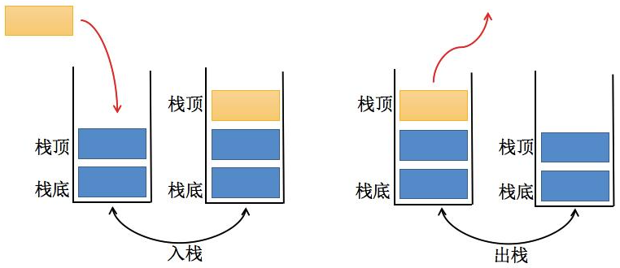

# 一、概述

## 1. 概念

**什么是数据结构？**

民间定义：

- 数据结构是数据对象，以及存在于该对象的实例和组成实例的数据元素之间的各种关系。这些联系可以通过定义相关的函数来给出。 --《数据结构、算法与应用》
- 数据结构是 ADT（抽象数据类型 Abstract Data Type）的物理实现。 --《数据结构与算法分析》
- 数据结构（data structure）是计算机中存储、组织数据的方式。通常情况下，精心选择的数据结构可以带来最优效率的算法。 --中文维基百科（*）

自己的角度来理解：

- 数据结构就是在计算机中，存储和组织数据的方式。
- 我们知道，计算机中数据量非常庞大，如何以高效的方式组织和存储数据呢？
- 这就好比一个庞大的图书馆中存放了大量的数据，我们不仅仅把书放进去，还应在合适的位置找出来。

**什么是算法？**

- 算法就是解决问题的办法/步骤逻辑；
- 数据结构的实现，离不开算法；

## 2. 数据结构分类

常见的数据结构

**逻辑结构**

- 集合结构（无关系）
- 线性结构（一对一）-- 链表
- 树形结构（一对多）
- 图形结构（多对多）

**物理结构**

- 顺序结构
- 链式结构

# 二、算法分析

## 1. 时间复杂度

时间复杂度是指执行这个算法所需要的计算工作量，其复杂度反映了程序执行时间**「随输入规模增长而增长的量级」**，在很大程度上能很好地反映出算法的优劣与否。一个算法花费的时间与算法中语句的**「执行次数成正比」**，执行次数越多，花费的时间就越多。一个算法中的执行次数称为语句频度或时间频度，记为T(n)，其中n称为问题的规模，当n不断变化时，它所呈现出来的规律，我们称之为时间复杂度。比如：

=n^2+1)

与

=5n^2+2n+1)

虽然算法的时间频度不一样，但他们的时间复杂度却是一样的，**「时间复杂度只关注最高数量级，且与之系数也没有关系」**。通常一个算法由控制结构（顺序，分支，循环三种）和原操作（固有数据类型的操作）构成，而算法时间取决于两者的综合效率。

## 2. 空间复杂度

空间复杂度是对一个算法在运行过程中临时占用存储空间大小的量度，所谓的临时占用存储空间指的就是代码中**「辅助变量所占用的空间」**，它包括为参数表中**「形参变量」**分配的存储空间和为在函数体中定义的**「局部变量」**分配的存储空间两个部分。我们用 S(n)=O(f(n))来定义，其中n为问题的规模(或大小)。通常来说，只要算法不涉及到动态分配的空间，以及递归、栈所需的空间，空间复杂度通常为0(1)。一个一维数组`a[n]`，空间复杂度O(n)，二维数组为O(n^2)。

## 1. 时间复杂度分析 -- 大O表示法

通过“大O”标识符 <u>粗略</u> 估算时间复杂度。

函数渐近增长推导大O阶的表示法有以下几个规则可以用使用:

- 用常数1取代运行时间中的所有加法常数；
- 在修改后运行次数中，只保留高阶项；
- 如果最高阶项存在，且常数因子不为1，则去除与这个项相乘的常数；

**常见大O阶**

下面是对常见时间复杂度的一个总结：

| 描述         | 增长的数量级 | 说明     | 举例           |
| ------------ | ------------ | -------- | -------------- |
| 常数级别     | $1$          | 普通语句 | 将两个数相加   |
| 对数级别     | $log(n)$     | 二分策略 | 二分查找       |
| 线性级别     | $n$          | 循环     | 找出最大元素   |
| 线性对数级别 | $nlog(n)$    | 分治思想 | 归并排序       |
| 平方级别     | $n^2$        | 双层循环 | 检查所有元素对 |
| 立方级别     | $n^3$        | 三层循环 | 检查所有三元组 |
| 指数级别     | $2^n$        | 穷举查找 | 检查所有子集   |

时间复杂度从低到高一次为：

**O(1) < O(logn) < O(n) < O(nlogn)** < O(n^2) < O(n^3)

## 2. 空间复杂度分析

# 三、数据结构

## 1. 数组

数组是一种线性结构，是一堆连续的内存位置，用来保存一些值。

数组查询（通过下标）快，但是插入和删除性能不佳。

<u>为什么说数组查询快，插入和删除消耗性能高？</u>

- 数组是连续的空间；
- 数组扩容/移位消耗性能
- 比如一个数组有100个元素，要在第一个插入一个新的元素，那么需要将已有的100个元素全部移位，腾出第一个位置来插入元素，所以消耗性能就多，删除亦是如此。而查询快是因为数组可以通过下标直接获取元素。

<u>JavaScript数组底层如何实现？</u>

[参考这里 >>](https://www.voidcanvas.com/javascript-array-evolution-performance)

 JavaScript 数组是作为哈希映射或字典实现的，而不是连续的.它可以使用各种数据结构来实现，其中之一是链表

## 2. 栈 

我们知道数组是一种线性结构，并且可以在数组的人以位置插入和删除数据。但是有时候，我们为了实现某些功能，必须对这种任意性加以限制，而栈和队列，就是比较常见的受限的线性结构。栈的特点是：**后进先出（LIFO)**

# 四、排序算法

