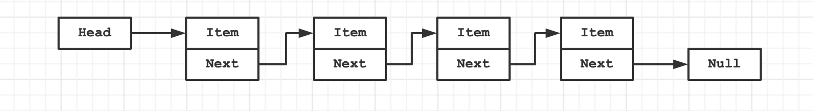

# 一、概述

## 1. 概念

**什么是数据结构？**

民间定义：

- 数据结构是数据对象，以及存在于该对象的实例和组成实例的数据元素之间的各种关系。这些联系可以通过定义相关的函数来给出。 --《数据结构、算法与应用》
- 数据结构是 ADT（抽象数据类型 Abstract Data Type）的物理实现。 --《数据结构与算法分析》
- 数据结构（data structure）是计算机中存储、组织数据的方式。通常情况下，精心选择的数据结构可以带来最优效率的算法。 --中文维基百科（*）

自己的角度来理解：

- 数据结构就是在计算机中，存储和组织数据的方式。
- 我们知道，计算机中数据量非常庞大，如何以高效的方式组织和存储数据呢？
- 这就好比一个庞大的图书馆中存放了大量的数据，我们不仅仅把书放进去，还应在合适的位置找出来。

**什么是算法？**

- 算法就是解决问题的办法/步骤逻辑；
- 数据结构的实现，离不开算法；

## 2. 数据结构分类

常见的数据结构


**逻辑结构**

- 集合结构（无关系）
- 线性结构（一对一）-- 链表
- 树形结构（一对多）
- 图形结构（多对多）

**物理结构**

- 顺序结构
- 链式结构

# 二、算法分析

## 1. 时间复杂度

时间复杂度是指执行这个算法所需要的计算工作量，其复杂度反映了程序执行时间**「随输入规模增长而增长的量级」**，在很大程度上能很好地反映出算法的优劣与否。一个算法花费的时间与算法中语句的**「执行次数成正比」**，执行次数越多，花费的时间就越多。一个算法中的执行次数称为语句频度或时间频度，记为T(n)，其中n称为问题的规模，当n不断变化时，它所呈现出来的规律，我们称之为时间复杂度。比如：

=n^2+1)

与

=5n^2+2n+1)

虽然算法的时间频度不一样，但他们的时间复杂度却是一样的，**「时间复杂度只关注最高数量级，且与之系数也没有关系」**。通常一个算法由控制结构（顺序，分支，循环三种）和原操作（固有数据类型的操作）构成，而算法时间取决于两者的综合效率。

## 2. 空间复杂度

空间复杂度是对一个算法在运行过程中临时占用存储空间大小的量度，所谓的临时占用存储空间指的就是代码中**「辅助变量所占用的空间」**，它包括为参数表中**「形参变量」**分配的存储空间和为在函数体中定义的**「局部变量」**分配的存储空间两个部分。我们用 S(n)=O(f(n))来定义，其中n为问题的规模(或大小)。通常来说，只要算法不涉及到动态分配的空间，以及递归、栈所需的空间，空间复杂度通常为0(1)。一个一维数组`a[n]`，空间复杂度O(n)，二维数组为O(n^2)。

## 1. 时间复杂度分析 -- 大O表示法

通过“大O”标识符 <u>粗略</u> 估算时间复杂度。

函数渐近增长推导大O阶的表示法有以下几个规则可以用使用:

- 用常数1取代运行时间中的所有加法常数；
- 在修改后运行次数中，只保留高阶项；
- 如果最高阶项存在，且常数因子不为1，则去除与这个项相乘的常数；


**常见大O阶**


下面是对常见时间复杂度的一个总结：

| 描述         | 增长的数量级 | 说明     | 举例           |
| ------------ | ------------ | -------- | -------------- |
| 常数级别     | $1$          | 普通语句 | 将两个数相加   |
| 对数级别     | $log(n)$     | 二分策略 | 二分查找       |
| 线性级别     | $n$          | 循环     | 找出最大元素   |
| 线性对数级别 | $nlog(n)$    | 分治思想 | 归并排序       |
| 平方级别     | $n^2$        | 双层循环 | 检查所有元素对 |
| 立方级别     | $n^3$        | 三层循环 | 检查所有三元组 |
| 指数级别     | $2^n$        | 穷举查找 | 检查所有子集   |

时间复杂度从低到高一次为：

**O(1) < O(logn) < O(n) < O(nlogn)** < O(n^2) < O(n^3)

## 2. 空间复杂度分析

# 三、数据结构

## 1. 数组

数组是一种线性结构，是一堆连续的内存位置，用来保存一些值。

数组查询（通过下标）快，但是插入和删除性能不佳。

<u>为什么说数组查询快，插入和删除消耗性能高？</u>

- 数组是连续的空间；
- 数组扩容/移位消耗性能
- 比如一个数组有100个元素，要在第一个插入一个新的元素，那么需要将已有的100个元素全部移位，腾出第一个位置来插入元素，所以消耗性能就多，删除亦是如此。而查询快是因为数组可以通过下标直接获取元素。

<u>JavaScript数组底层如何实现？</u>

[参考这里 >>](https://www.voidcanvas.com/javascript-array-evolution-performance)

 JavaScript 数组是作为哈希映射或字典实现的，而不是连续的.它可以使用各种数据结构来实现，其中之一是链表

## 2. 栈 

我们知道数组是一种线性结构，并且可以在数组的任意位置插入和删除数据。但是有时候，我们为了实现某些功能，必须对这种任意性加以限制，而栈和队列，就是比较常见的受限的线性结构。栈的特点是：**后进先出（LIFO)**


**数组实现：**

```javascript
/**
 * 栈结构方法
 * - push(data)：添加一个新元素到栈顶位置
 * - pop()：移除栈顶的元素，同时返回被移除的元素
 * - peek()：返回栈顶的元素，不对栈做任何修改（这个方法不会移除栈顶的元素，仅仅返回它）
 * - isEmpty()：如果栈里没有任何元素就返回true，否则返回false
 * - size()：返回栈里的元素个数。这个方法和数组的length很类似。
 */
class Stack {
  constructor() {
    this.items = [];
  }
  push(data) {
    this.items.push(data);
  }
  pop() {
    return this.items.pop();
  }
  peek() {
    return this.items[this.items.length - 1];
  }
  isEmpty() {
    return this.items.length === 0;
  }
  size() {
    return this.items.length;
  }
}
```

栈结构实现10进制转二进制：

```js
function dec2bin(num) {
  // 1. 创建Stack
  const stack = new Stack();
  // 2. 循环取余数
  while (num > 0) {
    let remainder = num % 2;
    num = Math.floor(num / 2);
    stack.push(remainder);
  }
  // 3. 拼接字符串
  let binString = "";
  while (!stack.isEmpty()) {
    binString += stack.pop();
  }
  return binString;
}
console.log(dec2bin(10)); // 1010
console.log(dec2bin(100)); // 1100100
console.log(dec2bin(1000)); // 1111101000
```

## 3. 队列

队列（queue），是一种受限的数据结构（线性表），具有 **先进先出（FIFO First In First Out）**的特点。

受限之处在于队列只允许在表的前端（front）进行删除操作，而在表的后端（rear）进行插入操作。


打印队列/线程队列/事件队列/任务队列

**数组实现：**

```js
/**
 * 1. enqueue(element)：向队列尾部添加一个（或多个）新的项
 * 2. dequeue()：移除队列的第一（即排在队列最前面的）项，并返回被移除的元素
 * 3. front()：返回队列中第一个元素-最先被添加，也将是最先被移除的元素。队列不做任何变动（不溢出元素，只返回元素信息）
 * 4. isEmpty()：如果队列中不包含任何元素，返回true，否则返回false
 * 5. size()：返回队列包含的元素个数，与数组的length属性雷士
 */
class Queue {
  constructor() {
    this.items = [];
  }
  enqueue(element) {
    this.items.push(element);
  }
  dequeue() {
    return this.items.shift();
  }
  front() {
    if (this.isEmpty()) return null;
    return this.items[0];
  }
  isEmpty() {
    return this.items.length === 0;
  }
  size() {
    return this.items.length;
  }
}

module.exports = Queue;
```

应用场景：**击鼓传花**

## 4. 优先级队列

优先级队列的特点：

- 我们知道，普通的队列插入一个元素，数据会被放在后端，并且需要前面所有的元素都处理完成后才会处理前面的数据。
- 但是优先级队列，在插入一个元素的时候会考虑该数据的优先级。
- 和其他数据优先级进行比较，
- 比较完成后，可以得出这个元素在队列中正确的位置。
- 其他处理方式，和基本队列的处理方式一样。

**数组实现：**

```js
class PriorityQueue extends Queue {
  enqueue(element, priority) {
    // 1. 创建QueueElement对象
    const queueElement = { element, priority };
    // 2. 考虑如何插入新的元素
    if (this.isEmpty()) {
      this.items.push(queueElement);
    } else {
      let added = false;
      for (let i = 0; i < this.items.length; i++) {
        if (this.items[i].priority > queueElement.priority) {
          this.items.splice(i, 0, queueElement);
          added = true;
          break;
        }
      }
      if (!added) {
        this.items.push(queueElement);
      }
    }
  }
}
```

## 5. 链表

链表（线性结构）和数组一样，可用于 **存储一系列的元素**，但是链表和数组的实现机制完全不同。

**回顾 >**

数组：

- 要存储多个元素，数组（或称为列表）可能是 **最常用** 的数据结构。
- 几乎每一种编程语言都有默认实现 **数组结构** 。
- 但是数组也有很多缺点：
  - 数组的创建通常需要申请一段 **连续的内存空间** （一整块的内存），并且大小是固定的（大多数编程语言数组都是固定的），所以当当前数组 **不能满足容量需求** 时，需要 **扩容** 。（一般情况下是申请一个更大的数组，比如2倍，然后将原数组中的元素复制过去）
  - 而且在数组开头或中间位置插入数据的成本很高，需要进行大量元素的位移。
  - 尽管我们已经学过的JavaScript的Array类方法可以帮我们做这些事，但背后的原理依然是这样。

**链表 >**

- 要存储多个元素，另外一个选择就是链表。
- 但不同于数组，链表中的元素在内存中 **不必是连续的空间**。
- 链表的每个元素由一个存储 **元素本身的节点** 和一个 **指向下一个元素的引用** （有些语言称为指针或者链接）组成。

相对于数组，链表有一些优点：

- 内存空间不是必须连续的，可以充分利用计算机的内存，实现灵活的 **内存动态管理**。
- 链表不必在创建时就 **确定大小**，并且大小可以 **无限的延伸** 下去。
- 链表在 **插入和删除** 数据时，**时间复杂度** 可以达到 $O(1)$ ，相对数组效率高很多。

相对于数组，链表有一些缺点：

- 链表访问任何一个位置的元素时，都需要 **从头开始访问** （无法跳过第一个元素访问任何一个元素）。
- 无法通过下标直接访问元素，需要从头一个个访问，直到找到对应的元素。


**那到底什么链表呢？**

其实上面我们已经简单的提过了链表的结构，我们这里更加详细的分析一下，链表类似于火车：有一个火车头，火车头会链接一个节点，节点上有乘客（类似于数据），并且这个节点会链接下一个节点，以此类推。


我们来看一个更加形象的图：




### 5.1. 单向链表

- 单向链表只能 **从头遍历到尾** 或者 **从尾遍历到头** （一般从头到尾）。
- 也就是说链表相连的过程是 **单向** 的。
- 实现的原理是上一个节点中有一个指向下一个的 **引用**。

**实现：**

```javascript
/**
 * 节点对象
 */
class LinkedListNode {
  constructor(data) {
    // 保存元素
    this.data = data;
    // 指向下一个节点
    this.next = null;
  }
}
/**
 * 单向链表
 * - append(data)：向链表尾部添加一个新的项
 * - insert(position, data)：向链表的特定位置插入一个新的项
 * - get(position)：获取对应位置的元素
 * - indexOf(data)：返回元素在链表中的索引，如果链表中没有该元素则返回-1
 * - removeAt(position)：移除某个位置的元素
 * - update(positon, data)：修改某个位置的元素
 * - remove(data)：移除链表中的一项
 * - isEmpty()：判断是否为空链表
 * - size()
 */
export class LinkedList {
  constructor() {
    this.head = null;
    this.length = 0;
  }

  append(data) {
    // 1. 根据data创建Node对象
    const newNode = new LinkedListNode(data);
    // 2. 追加到最后，考虑两种情况：
    // - 如果当前链表为空链表，直接让head指向新建节点即可；
    // - 否则，依次遍历节点，找到最后一个节点，将其next指向新建节点；
    if (!this.head) {
      this.head = newNode;
    } else {
      let current = this.head;
      while (current.next) {
        current = current.next;
      }
      current.next = newNode;
    }
    this.length++;
  }
  insert(position, data) {
    // 1. 判断越界问题
    if (position < 0 || position > this.length) return false;
    // 2. 创建新的节点
    const newNode = new LinkedListNode(data);
    // 3. 插入元素，考虑两种情况
    // - 如果插入在第1个位置，则将新节点的next指向head，并将head指向新节点。
    // - 否则，遍历找到对应位置的节点（current）和其上一个节点（previous）
    // - 然后将previous.next指向新节点，并将新节点的nex指向current节点即可。
    if (position === 0) {
      newNode.next = this.head;
      this.head = newNode;
    } else {
      let index = 0;
      let current = this.head;
      let previous = null;
      while (index++ < position) {
        previous = current;
        current = current.next;
      }
      previous.next = newNode;
      newNode.next = current;
    }
    this.length++;
    return true;
  }
  get(position) {
    // 1. 处理越界问题
    if (position < 0 || position > this.length - 1) return null;
    // 2. 查找该位置的元素
    let index = 0;
    let current = this.head;
    while (index++ < position) {
      current = current.next;
    }
    return current.data;
  }
  indexOf(data) {
    // 1. 获取第一个元素
    let current = this.head;
    // 2. 开始查找
    let index = 0;
    while (current) {
      if (current.data === data) {
        return index;
      }
      current = current.next;
      index++;
    }
    return -1;
  }
  removeAt(position) {
    // 1. 处理越界
    if (position < 0 || position > this.length - 1) return null;
    // 2. 删除元素，考虑两种情况：
    // - 如果移除第1个元素，则直接将head指向head.next即可。
    // - 否则，遍历找到要移除的元素（current）及其上一个元素（previous）
    // - 然后将previous.next指向current.next即可。
    let index = 0;
    let current = this.head;
    let previous = null;
    if (position === 0) {
      this.head = current.next;
    } else {
      while (index++ < position) {
        previous = current;
        current = current.next;
      }
      previous.next = current.next;
    }
    this.length--;
    return current.data;
  }
  update(positon, data) {
    // 1. 处理越界
    if (positon < 0 || positon > this.length - 1) return null;
    // 2. 删除position位置的元素
    const result = this.removeAt(positon);
    // 3. 插入position位置data元素
    this.insert(positon, data);
    return result;
  }
  remove(data) {
    // 1. 获取元素位置
    const index = this.indexOf(data);
    // 2. 删除该位置的元素
    if (index !== -1) {
      this.removeAt(index);
    }
  } 
  isEmpty() {
    return this.length === 0;
  }
  size() {
    return this.length;
  }
}

```

### 5.2. 双向链表

单向列表有一个比较明显的缺点：

- 我们可以轻松的到达 **下一个节点**，但是回到 **前一个节点** 是很难的，但是，实际开发中，经常会遇到需要回到上一个节点的情况。
- 举个例子：假设一个文本编辑用 **链表** 来存储文本，每一行用一个 **String对象** 存储在 **链表的一个节点** 中，当编辑器用户 **向下移动光标** 时，链表直接操作到 **下一个节点** 即可，但是当用于将光标 **向上移动** 呢？这个时候为了回到 **上一个节点**，我们可能需要 **从first开始**，一次走到想要的节点上。

双向链表，既可以 **从头遍历到尾**，又可以 **从尾遍历到头**，也就是链表相连的过程是 **双向** 的。

实现原理：一个节点既有 **向前连接的引用**，也有一个 **向后连接的引用**。

双向链表可以有效地解决单向链表中提到的问题。

**双向链表有什么缺点呢？**

- 每次在 **插入或删除** 某个节点时，需要处理四个引用，而不是两个，也就是实现起来要困难一些。
- 并且相当于单向链表，必然占用 **内存空间更大** 一些。
- 但是这些缺点和我们使用起来的方便程度相比，是微不足道的。

**双向链表的特点：**


- 可以使用一个head和一个tail分别指向头部和尾部的节点。
- 每个节点都由三部分组成：前一个节点的指针（prev）、保存的元素（item）、后一个节点的指针（next）。
- 双向链表的第一个节点的prev是null。
- 双向链表的最后一个节点的next是null。

**实现：**

```js
/**
 * 双向链表
 */
class DoubleLinkedListNode extends LinkedListNode {
  constructor(data) {
    super(data);
    this.prev = null;
  }
}

export class DoubleLinkedList extends LinkedList {
  constructor() {
    super();
    this.tail = null;
  }
  append(data) {
    // 1. 根据data创建Node对象
    const newNode = new DoubleLinkedListNode(data);
    // 2. 追加元素，考虑两种情况：
    // - 如果当前链表中一个元素都没有，则让head和tail都指向新节点
    // - 否则让最后一个元素的next指向新节点；新节点的prev指向tail；tail指向新节点；
    if (!this.head) {
      this.head = newNode;
      this.tail = newNode;
    } else {
      this.tail.next = newNode;
      newNode.prev = this.tail;
      this.tail = newNode;
    }
    this.length++;
  }
  // 向链表的特定位置插入一个新的项
  insert(position, data) {
    // 1. 判断越界问题
    if (position < 0 || position > this.length) return false;
    // 2. 创建新的节点
    const newNode = new DoubleLinkedListNode(data);
    // 3. 判断多种插入情况
    if (position === 0) {
      // 头部插入
      if (!this.head) {
        this.head = newNode;
        this.tail = newNode;
      } else {
        newNode.next = this.head;
        this.head.prev = newNode;
        this.head = newNode;
      }
    } else if (position === this.length) {
      // 尾部插入
      this.tail.next = newNode;
      newNode.prev = this.tail;
      this.tail = newNode;
    } else {
      // 中间插入
      let index = 0;
      let current = this.head;
      while (index++ < position) {
        current = current.next;
      }
      // 交换节点信息
      current.prev.next = newNode;
      newNode.prev = current.prev;
      newNode.next = current;
      current.prev = newNode;
    }
    this.length++;
    return true;
  }
  removeAt(position) {
    // 1. 处理越界
    if (position < 0 || position > this.length - 1) return null;
    // 2. 根据不同的情况来删除元素
    let index = 0;
    let current = this.head;
    if (position === 0) {
      if (this.length === 1) {
        this.head = null;
        this.tail = null;
      } else {
        this.head = this.head.next;
        this.head.prev = null;
      }
    } else if (position === this.length - 1) {
      current = this.tail;
      this.tail = this.tail.prev;
      this.tail.next = null;
    } else {
      while (index++ < position) {
        current = current.next;
      }
      current.prev.next = current.next;
      current.next.prev = current.prev;
    }
    this.length--;
    return current.data;
  }
}
```

### 5.3. 拓展

**链表实现栈：**

```javascript
import { DoubleLinkedList } from "../linked_list/index.js";
export class Stack {
  constructor() {
    // 创建链表
    this.items = new DoubleLinkedList();
  }
  push(data) {
    this.items.append(data);
  }
  pop() {
    return this.items.removeAt(this.items.size() - 1);
  }
  peek() {
    return this.items.get(this.items.size() - 1);
  }
  isEmpty() {
    return this.items.size() === 0;
  }
  size() {
    return this.items.size();
  }
}
```

## 6. 哈希表

哈希表是一种非常重要的数据结构。几乎所有的编程语言都有 **直接或者间接** 的应用这种数据结构。

哈希表通常是基于 **数组** 实现的，但是相对于数组，它也有很多的优势：

- 它可以提供非常快速的 **插入-删除-查找操作**
- 无论多少数据，插入和删除值需要接近常量的时间：即 $O(1)$ 的时间级，实际上，只需要 **几个机器指令** 即可完成
- 哈希表的速度比 **树还要快**，基本可以瞬间查找到想要的元素
- 哈希表相对于树来说编码要容易很多


# 四、排序算法

